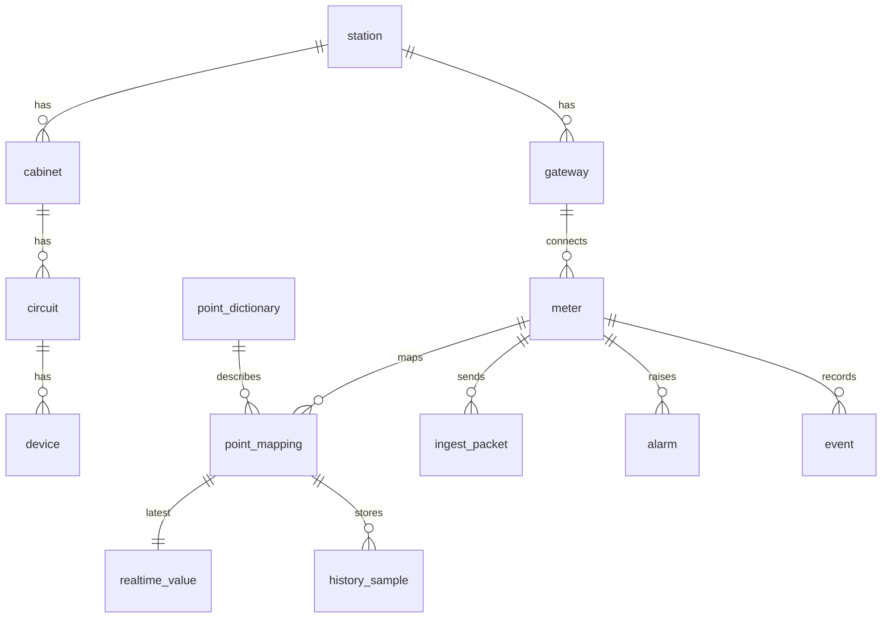

# 服务器端轻量化数据库设计

## 1. 设计定位

软件1通过 `POST /api/ingest/packets` 向数据库侧入库服务发送 JSON 数据包。服务器端数据库负责保存入库结果，并支撑软件2完成实时展示、历史曲线、告警事件、接口状态和设备档案管理。

本项目是单站轻量版演示系统，建议首版使用 **SQLite** 作为嵌入式数据库：

- 零服务依赖，便于在 Windows 笔记本上随软件2一起交付。
- 支持事务、索引、视图和 JSON 原始报文留存。
- 单站、一只或少量 AMC 仪表、3 秒级采样的写入压力很低，SQLite 足够稳定。
- 后续若扩展到多站或高频大量设备，可按相同逻辑迁移到 PostgreSQL/TimescaleDB。

建议数据库文件：

```text
data/pq_monitor.sqlite3
```

建议连接参数：

```sql
PRAGMA journal_mode = WAL;
PRAGMA synchronous = NORMAL;
PRAGMA foreign_keys = ON;
PRAGMA busy_timeout = 5000;
```

## 2. 数据分层

数据库分为四类数据：

| 分类 | 作用 | 典型表 |
| --- | --- | --- |
| 基础组态 | 描述站点、柜体、回路、设备、网关、仪表和点位字典 | `station`、`cabinet`、`circuit`、`device`、`gateway`、`meter`、`point_dictionary`、`point_mapping` |
| 接入流水 | 保留软件1发来的数据包、接收状态和通信状态 | `ingest_packet`、`interface_status` |
| 运行数据 | 保存最新值、历史采样、统计值、告警和事件 | `realtime_value`、`history_sample`、`statistic_record`、`alarm`、`event` |
| 管理数据 | 支撑报表、抄表、维护记录、用户和操作日志 | `report_record`、`meter_reading_record`、`maintenance_record`、`app_user`、`operation_log` |

首版最小闭环必须实现：

```text
station / gateway / meter / point_dictionary / point_mapping
ingest_packet / interface_status
realtime_value / history_sample / statistic_record
alarm / event
```

## 3. 命名约定

- 主键统一使用 `TEXT` 类型业务 ID，例如 `station-001`、`amc-001`；流水表使用 `INTEGER PRIMARY KEY AUTOINCREMENT`。
- 时间统一保存 ISO 8601 文本，示例：`2026-05-21T14:30:00+08:00`。
- 数值统一使用 `REAL`；原始寄存器值使用 `INTEGER`。
- 质量码使用软件1已有枚举：`good`、`stale`、`timeout`、`crc_error`、`parse_error`、`out_of_range`、`unsupported`、`simulated`、`not_connected`。
- 原始数据包完整保存到 `ingest_packet.raw_json`，便于联调追溯。

## 4. 核心实体关系



## 5. 建表 SQL

### 5.1 基础组态表

```sql
CREATE TABLE IF NOT EXISTS station (
    id TEXT PRIMARY KEY,
    name TEXT NOT NULL,
    description TEXT,
    created_at TEXT NOT NULL DEFAULT CURRENT_TIMESTAMP,
    updated_at TEXT NOT NULL DEFAULT CURRENT_TIMESTAMP
);

CREATE TABLE IF NOT EXISTS cabinet (
    id TEXT PRIMARY KEY,
    station_id TEXT NOT NULL,
    code TEXT NOT NULL,
    name TEXT NOT NULL,
    voltage_level TEXT,
    cabinet_type TEXT,
    status TEXT NOT NULL DEFAULT 'not_connected',
    sort_order INTEGER NOT NULL DEFAULT 0,
    FOREIGN KEY (station_id) REFERENCES station(id)
);

CREATE TABLE IF NOT EXISTS circuit (
    id TEXT PRIMARY KEY,
    station_id TEXT NOT NULL,
    cabinet_id TEXT,
    code TEXT NOT NULL,
    name TEXT NOT NULL,
    circuit_type TEXT,
    status TEXT NOT NULL DEFAULT 'not_connected',
    rated_voltage REAL,
    rated_current REAL,
    FOREIGN KEY (station_id) REFERENCES station(id),
    FOREIGN KEY (cabinet_id) REFERENCES cabinet(id)
);

CREATE TABLE IF NOT EXISTS device (
    id TEXT PRIMARY KEY,
    station_id TEXT NOT NULL,
    cabinet_id TEXT,
    circuit_id TEXT,
    code TEXT NOT NULL,
    name TEXT NOT NULL,
    device_type TEXT NOT NULL,
    model TEXT,
    manufacturer TEXT,
    status TEXT NOT NULL DEFAULT 'not_connected',
    description TEXT,
    FOREIGN KEY (station_id) REFERENCES station(id),
    FOREIGN KEY (cabinet_id) REFERENCES cabinet(id),
    FOREIGN KEY (circuit_id) REFERENCES circuit(id)
);

CREATE TABLE IF NOT EXISTS gateway (
    id TEXT PRIMARY KEY,
    station_id TEXT NOT NULL,
    name TEXT NOT NULL,
    protocol_version TEXT,
    last_seen_at TEXT,
    status TEXT NOT NULL DEFAULT 'offline',
    description TEXT,
    FOREIGN KEY (station_id) REFERENCES station(id)
);

CREATE TABLE IF NOT EXISTS meter (
    id TEXT PRIMARY KEY,
    station_id TEXT NOT NULL,
    gateway_id TEXT NOT NULL,
    device_id TEXT,
    name TEXT NOT NULL,
    model TEXT,
    slave_id INTEGER,
    protocol TEXT NOT NULL DEFAULT 'Modbus-RTU',
    status TEXT NOT NULL DEFAULT 'offline',
    last_sample_at TEXT,
    last_sequence INTEGER,
    FOREIGN KEY (station_id) REFERENCES station(id),
    FOREIGN KEY (gateway_id) REFERENCES gateway(id),
    FOREIGN KEY (device_id) REFERENCES device(id)
);
```

### 5.2 点位字典与映射

`point_dictionary` 直接复用软件1 `AMC-E4KC点表-v1.json` 中的点位编码，例如 `ua`、`ub`、`ia`、`p_total`、`frequency`、`ep_import`。

```sql
CREATE TABLE IF NOT EXISTS point_dictionary (
    code TEXT PRIMARY KEY,
    name TEXT NOT NULL,
    unit TEXT,
    value_type TEXT NOT NULL DEFAULT 'number',
    source TEXT,
    category TEXT,
    enabled INTEGER NOT NULL DEFAULT 1,
    description TEXT
);

CREATE TABLE IF NOT EXISTS point_mapping (
    id TEXT PRIMARY KEY,
    station_id TEXT NOT NULL,
    meter_id TEXT NOT NULL,
    point_code TEXT NOT NULL,
    cabinet_id TEXT,
    circuit_id TEXT,
    device_id TEXT,
    display_name TEXT,
    is_primary INTEGER NOT NULL DEFAULT 1,
    FOREIGN KEY (station_id) REFERENCES station(id),
    FOREIGN KEY (meter_id) REFERENCES meter(id),
    FOREIGN KEY (point_code) REFERENCES point_dictionary(code),
    FOREIGN KEY (cabinet_id) REFERENCES cabinet(id),
    FOREIGN KEY (circuit_id) REFERENCES circuit(id),
    FOREIGN KEY (device_id) REFERENCES device(id),
    UNIQUE (meter_id, point_code)
);
```

### 5.3 数据包接入表

```sql
CREATE TABLE IF NOT EXISTS ingest_packet (
    id INTEGER PRIMARY KEY AUTOINCREMENT,
    protocol_version TEXT NOT NULL,
    packet_type TEXT NOT NULL,
    station_id TEXT,
    gateway_id TEXT,
    meter_id TEXT,
    sequence INTEGER,
    packet_timestamp TEXT NOT NULL,
    received_at TEXT NOT NULL DEFAULT CURRENT_TIMESTAMP,
    parse_status TEXT NOT NULL DEFAULT 'ok',
    error_message TEXT,
    raw_json TEXT NOT NULL,
    UNIQUE (gateway_id, meter_id, sequence)
);

CREATE INDEX IF NOT EXISTS idx_ingest_packet_meter_time
ON ingest_packet (meter_id, packet_timestamp DESC);

CREATE INDEX IF NOT EXISTS idx_ingest_packet_type_time
ON ingest_packet (packet_type, packet_timestamp DESC);
```

说明：

- `UNIQUE (gateway_id, meter_id, sequence)` 用于识别重复包。
- `raw_json` 保存原始数据包，前端接口管理页面可以展示最近报文。
- 解析失败的数据包也应保存，`parse_status='error'`，便于联调定位。

### 5.4 实时值与历史采样

```sql
CREATE TABLE IF NOT EXISTS realtime_value (
    mapping_id TEXT PRIMARY KEY,
    station_id TEXT NOT NULL,
    meter_id TEXT NOT NULL,
    point_code TEXT NOT NULL,
    value REAL,
    raw_value INTEGER,
    unit TEXT,
    quality TEXT NOT NULL,
    sample_time TEXT NOT NULL,
    received_at TEXT NOT NULL DEFAULT CURRENT_TIMESTAMP,
    source TEXT,
    FOREIGN KEY (mapping_id) REFERENCES point_mapping(id)
);

CREATE TABLE IF NOT EXISTS history_sample (
    id INTEGER PRIMARY KEY AUTOINCREMENT,
    mapping_id TEXT NOT NULL,
    station_id TEXT NOT NULL,
    meter_id TEXT NOT NULL,
    point_code TEXT NOT NULL,
    value REAL,
    raw_value INTEGER,
    unit TEXT,
    quality TEXT NOT NULL,
    sample_time TEXT NOT NULL,
    received_at TEXT NOT NULL DEFAULT CURRENT_TIMESTAMP,
    packet_id INTEGER,
    FOREIGN KEY (mapping_id) REFERENCES point_mapping(id),
    FOREIGN KEY (packet_id) REFERENCES ingest_packet(id)
);

CREATE INDEX IF NOT EXISTS idx_history_mapping_time
ON history_sample (mapping_id, sample_time DESC);

CREATE INDEX IF NOT EXISTS idx_history_meter_point_time
ON history_sample (meter_id, point_code, sample_time DESC);
```

入库策略：

- 收到 `realtime` 包后，逐个 `points[]` 写入 `history_sample`。
- 同时对 `realtime_value` 执行 upsert，保持每个点位只有一条最新值。
- `unsupported`、`timeout`、`parse_error` 等质量码也要保存，前端据此显示离线、异常或未接入。

实时值 upsert 示例：

```sql
INSERT INTO realtime_value (
    mapping_id, station_id, meter_id, point_code,
    value, raw_value, unit, quality, sample_time, received_at, source
) VALUES (
    :mapping_id, :station_id, :meter_id, :point_code,
    :value, :raw_value, :unit, :quality, :sample_time, CURRENT_TIMESTAMP, :source
)
ON CONFLICT(mapping_id) DO UPDATE SET
    value = excluded.value,
    raw_value = excluded.raw_value,
    unit = excluded.unit,
    quality = excluded.quality,
    sample_time = excluded.sample_time,
    received_at = excluded.received_at,
    source = excluded.source;
```

### 5.5 统计记录

```sql
CREATE TABLE IF NOT EXISTS statistic_record (
    id INTEGER PRIMARY KEY AUTOINCREMENT,
    mapping_id TEXT NOT NULL,
    station_id TEXT NOT NULL,
    meter_id TEXT NOT NULL,
    point_code TEXT NOT NULL,
    window_start TEXT NOT NULL,
    window_end TEXT NOT NULL,
    min_value REAL,
    max_value REAL,
    avg_value REAL,
    sample_count INTEGER NOT NULL DEFAULT 0,
    quality TEXT NOT NULL DEFAULT 'good',
    packet_id INTEGER,
    FOREIGN KEY (mapping_id) REFERENCES point_mapping(id),
    FOREIGN KEY (packet_id) REFERENCES ingest_packet(id)
);

CREATE INDEX IF NOT EXISTS idx_stat_mapping_window
ON statistic_record (mapping_id, window_start DESC, window_end DESC);
```

### 5.6 告警与事件

```sql
CREATE TABLE IF NOT EXISTS alarm (
    id INTEGER PRIMARY KEY AUTOINCREMENT,
    station_id TEXT NOT NULL,
    meter_id TEXT,
    point_code TEXT,
    cabinet_id TEXT,
    circuit_id TEXT,
    device_id TEXT,
    alarm_type TEXT NOT NULL,
    level TEXT NOT NULL DEFAULT 'warning',
    title TEXT NOT NULL,
    description TEXT,
    trigger_value REAL,
    threshold_value REAL,
    status TEXT NOT NULL DEFAULT 'active',
    started_at TEXT NOT NULL,
    recovered_at TEXT,
    acknowledged_at TEXT,
    acknowledged_by TEXT,
    closed_at TEXT,
    closed_by TEXT,
    packet_id INTEGER,
    FOREIGN KEY (packet_id) REFERENCES ingest_packet(id)
);

CREATE INDEX IF NOT EXISTS idx_alarm_status_time
ON alarm (status, started_at DESC);

CREATE INDEX IF NOT EXISTS idx_alarm_meter_point_time
ON alarm (meter_id, point_code, started_at DESC);

CREATE TABLE IF NOT EXISTS event (
    id INTEGER PRIMARY KEY AUTOINCREMENT,
    station_id TEXT NOT NULL,
    meter_id TEXT,
    event_type TEXT NOT NULL,
    level TEXT NOT NULL DEFAULT 'info',
    title TEXT NOT NULL,
    description TEXT,
    event_time TEXT NOT NULL,
    packet_id INTEGER,
    raw_json TEXT,
    FOREIGN KEY (packet_id) REFERENCES ingest_packet(id)
);

CREATE INDEX IF NOT EXISTS idx_event_type_time
ON event (event_type, event_time DESC);
```

告警状态建议：

| 状态 | 含义 |
| --- | --- |
| `active` | 正在发生，未恢复 |
| `recovered` | 已恢复，未确认或未关闭 |
| `acknowledged` | 已确认 |
| `closed` | 已关闭归档 |

同一告警未恢复前不重复创建新告警，可按 `(meter_id, point_code, alarm_type, status='active')` 在业务层去重。

### 5.7 接口状态

```sql
CREATE TABLE IF NOT EXISTS interface_status (
    id TEXT PRIMARY KEY,
    station_id TEXT NOT NULL,
    gateway_id TEXT,
    meter_id TEXT,
    status TEXT NOT NULL,
    last_packet_type TEXT,
    last_sequence INTEGER,
    last_packet_at TEXT,
    last_received_at TEXT,
    error_count INTEGER NOT NULL DEFAULT 0,
    last_error TEXT,
    updated_at TEXT NOT NULL DEFAULT CURRENT_TIMESTAMP
);
```

收到 `heartbeat` 或任何有效数据包后更新：

- 网关在线状态。
- 仪表最后采样时间。
- 最近包类型和序号。
- 连续错误计数。

服务器定时任务可根据 `last_received_at` 判断离线，例如超过 10 秒未收到数据则置为 `offline` 并生成通信中断事件。

### 5.8 报表、抄表和维护记录

```sql
CREATE TABLE IF NOT EXISTS report_record (
    id INTEGER PRIMARY KEY AUTOINCREMENT,
    station_id TEXT NOT NULL,
    report_type TEXT NOT NULL,
    period_start TEXT NOT NULL,
    period_end TEXT NOT NULL,
    title TEXT NOT NULL,
    status TEXT NOT NULL DEFAULT 'generated',
    summary_json TEXT,
    file_path TEXT,
    created_by TEXT,
    created_at TEXT NOT NULL DEFAULT CURRENT_TIMESTAMP
);

CREATE TABLE IF NOT EXISTS meter_reading_record (
    id INTEGER PRIMARY KEY AUTOINCREMENT,
    station_id TEXT NOT NULL,
    meter_id TEXT NOT NULL,
    reading_time TEXT NOT NULL,
    ep_import REAL,
    unit TEXT DEFAULT 'kWh',
    quality TEXT NOT NULL DEFAULT 'good',
    source TEXT NOT NULL DEFAULT 'auto',
    created_at TEXT NOT NULL DEFAULT CURRENT_TIMESTAMP
);

CREATE INDEX IF NOT EXISTS idx_meter_reading_meter_time
ON meter_reading_record (meter_id, reading_time DESC);

CREATE TABLE IF NOT EXISTS maintenance_record (
    id INTEGER PRIMARY KEY AUTOINCREMENT,
    station_id TEXT NOT NULL,
    device_id TEXT,
    title TEXT NOT NULL,
    content TEXT,
    operator TEXT,
    occurred_at TEXT NOT NULL,
    created_at TEXT NOT NULL DEFAULT CURRENT_TIMESTAMP
);
```

### 5.9 用户与操作日志

轻量版可以先做最小用户模型，后续再扩展 RBAC。

```sql
CREATE TABLE IF NOT EXISTS app_user (
    id TEXT PRIMARY KEY,
    username TEXT NOT NULL UNIQUE,
    display_name TEXT NOT NULL,
    password_hash TEXT,
    role TEXT NOT NULL DEFAULT 'operator',
    enabled INTEGER NOT NULL DEFAULT 1,
    created_at TEXT NOT NULL DEFAULT CURRENT_TIMESTAMP
);

CREATE TABLE IF NOT EXISTS operation_log (
    id INTEGER PRIMARY KEY AUTOINCREMENT,
    user_id TEXT,
    action TEXT NOT NULL,
    target_type TEXT,
    target_id TEXT,
    description TEXT,
    created_at TEXT NOT NULL DEFAULT CURRENT_TIMESTAMP
);
```

## 6. 数据包入库流程

### 6.1 `realtime` 包

1. 校验 `protocolVersion`、`packetType`、`sequence`、`timestamp`、`station`、`gateway`、`meter`。
2. 写入 `ingest_packet`，若唯一键冲突则返回重复包结果。
3. 自动补齐或更新 `station`、`gateway`、`meter` 基础信息。
4. 遍历 `points[]`：
   - 根据 `meter_id + point.code` 查找 `point_mapping`。
   - 写入 `history_sample`。
   - upsert `realtime_value`。
5. 更新 `interface_status`、`gateway.status`、`meter.status`。
6. 触发阈值判断，必要时写入 `alarm` 和 `event`。

### 6.2 `statistics` 包

1. 写入 `ingest_packet`。
2. 遍历 `statistics[]`，写入 `statistic_record`。
3. 可用于报表和历史曲线的聚合加速。

### 6.3 `alarm` 包

1. 写入 `ingest_packet`。
2. 对每条 `alarms[]` 判断是否已有相同未恢复告警。
3. 新告警写入 `alarm(status='active')`。
4. 恢复类告警更新 `recovered_at` 和 `status='recovered'`。
5. 同步写入 `event`，便于统一事件查询。

### 6.4 `event` 包

1. 写入 `ingest_packet`。
2. 将 `events[]` 展平写入 `event`。

### 6.5 `heartbeat` 和 `comm_status` 包

1. 写入 `ingest_packet`。
2. 更新 `interface_status`。
3. 当通信状态从离线恢复到在线时写入恢复事件。
4. 当通信状态异常时写入通信事件或告警。

## 7. 初始化默认数据

首版启动时建议自动写入：

- `station-001`：演示变电站。
- `gateway-001`：笔记本网关。
- `amc-001`：AMC 智能电力仪表。
- 高压 `AA1-AA7`、低压 `AA0-AA11` 柜体。
- 软件1点表中的全部 `point_dictionary`。
- `amc-001` 到默认低压主进线柜或实际接入回路的 `point_mapping`。

默认仪表点位至少包含：

```text
ua, ub, uc, uab, ubc, uac,
ia, ib, ic,
pa, pb, pc, p_total,
qa, qb, qc, q_total,
pfa, pfb, pfc, pf_total,
sa, sb, sc, s_total,
frequency, ep_import,
u0, i0,
angle_ua, angle_ub, angle_uc,
voltage_unbalance, current_unbalance,
dido_status
```

## 8. 查询设计

### 8.1 实时监测

```sql
SELECT
    pm.cabinet_id,
    pm.circuit_id,
    pm.device_id,
    rv.point_code,
    pd.name,
    rv.value,
    rv.unit,
    rv.quality,
    rv.sample_time
FROM realtime_value rv
JOIN point_mapping pm ON pm.id = rv.mapping_id
JOIN point_dictionary pd ON pd.code = rv.point_code
WHERE rv.station_id = :station_id
ORDER BY pm.device_id, rv.point_code;
```

### 8.2 历史曲线

```sql
SELECT sample_time, value, quality
FROM history_sample
WHERE mapping_id = :mapping_id
  AND sample_time >= :start_time
  AND sample_time < :end_time
ORDER BY sample_time ASC;
```

### 8.3 最近接入包

```sql
SELECT packet_type, meter_id, sequence, packet_timestamp, received_at, parse_status, error_message
FROM ingest_packet
ORDER BY received_at DESC
LIMIT 100;
```

### 8.4 当前告警

```sql
SELECT *
FROM alarm
WHERE station_id = :station_id
  AND status IN ('active', 'recovered', 'acknowledged')
ORDER BY started_at DESC;
```

## 9. 数据保留策略

演示版建议默认：

| 数据 | 默认保留 | 说明 |
| --- | --- | --- |
| `realtime_value` | 永久 | 每点一条最新值 |
| `history_sample` | 30 天 | 3 秒采样，一只表约每天 3 万点位记录 |
| `statistic_record` | 180 天 | 支撑报表和趋势分析 |
| `ingest_packet` | 7 天 | 联调追溯即可，不建议永久保存全部原文 |
| `alarm` / `event` | 1 年 | 运维闭环需要较长留存 |
| `operation_log` | 1 年 | 审计追溯 |

清理任务必须按表、按时间分批删除，并且只删除数据库记录，不批量删除文件目录。

示例：

```sql
DELETE FROM history_sample
WHERE sample_time < :expire_before
LIMIT 5000;
```

## 10. 轻量化性能建议

- `history_sample` 是最大表，必须保留 `(mapping_id, sample_time)` 索引。
- 接收接口中每个数据包使用一个事务，避免逐点提交。
- 前端实时页读取 `realtime_value`，不要扫描历史表。
- 历史曲线默认限制时间范围，例如最近 1 小时、24 小时、7 天。
- 原始包 `raw_json` 仅保留短周期，避免数据库文件膨胀。
- 定期执行 `PRAGMA optimize;`，长时间运行后可在维护窗口执行 `VACUUM;`。

## 11. 后续扩展

当系统扩展到多站、多网关或高频点位时，可保持业务表结构不变，做以下升级：

- 将 SQLite 迁移到 PostgreSQL。
- 将 `history_sample` 和 `statistic_record` 改为按月分区或时序库 hypertable。
- 将 `raw_json` 改为 JSONB。
- 增加数据转发队列表，向管理中心或第三方系统上传。
- 增加 `tenant_id` 或 `project_id` 支持多项目部署。
